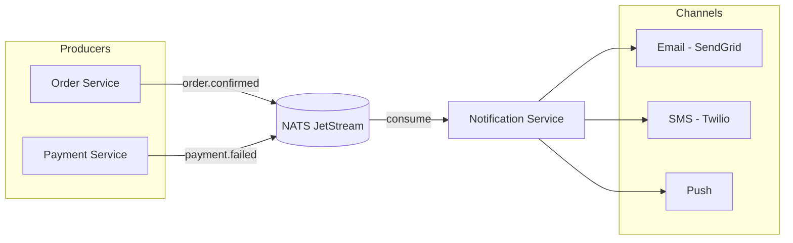

# 🔔 Notification Service

The **Notification Service** is a purely event-driven component that communicates with users across various channels.

## 🗺️ Event Flow

## 🛠️ Tech Stack

- **Framework**: NestJS
- **Messaging**: NATS JetStream (Consumer)
- **Email/SMS Adapters**: SendGrid, Twilio, etc.

## 📋 Responsibilities

1. **Purchase Confirmations**: Sending emails when orders are successfully confirmed.
2. **Shipping Alerts**: Notifying users when parcels are dispatched.
3. **Marketing/Reminders**: Sending personalized notifications based on user activity.

## 📡 Event Consumption

- **Decoupled Architecture**: This service subscribes to events (e.g., `order.confirmed`, `payment.failed`) and acts independently of the emitting service.

---

[⬅️ Back to Services Index](./README.md)
