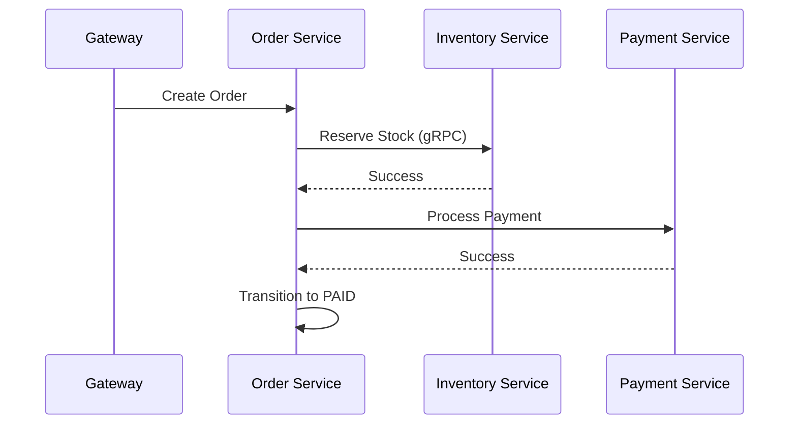

# 🛍️ Order Service

## Purpose

The Order Service is the primary orchestrator of the commerce lifecycle, managing everything from order creation to final fulfillment.

## Responsibilities

- **Order Creation**: Processing checkout requests.
- **State Management**: Managing the lifecycle (Pending -> Paid -> Shipped -> Delivered).
- **Inventory Coordination**: Communicating with Inventory Service for reservations.
- **Payment Integration**: Orchestrating with Payment Service for transactions.
- **Event Emission**: Emitting domain events for other services (e.g., `order.created`).

## Architecture

- **Pattern**: CQRS + Event-Driven.
- **Database**: PostgreSQL (Prisma).
- **Communication**: gRPC (Internal Sync) & NATS (External Async).

## 🗺️ Request Flow

## 📦 Folder Structure

- `src/application`: Use cases and command handlers.
- `src/domain`: Entities, value objects, and repository interfaces.
- `src/infrastructure`: DB entities, NATS providers, and gRPC clients.

---

[🔗 View Checkout Flow](../flows/checkout-flow.md) | [🏗️ View CQRS Pattern](../architecture/cqrs-pattern.md) | [⬅️ Back to Service Catalog](./README.md)
