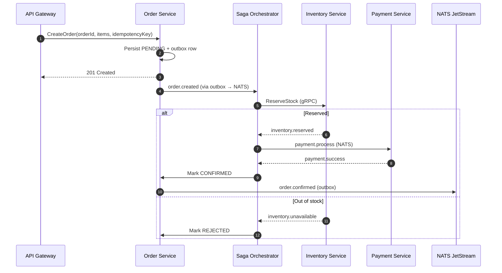
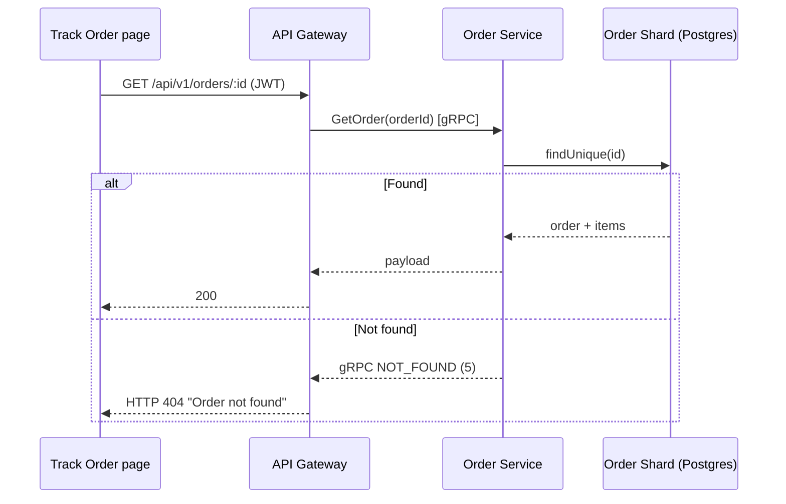

# 🛍️ Order Service

## Purpose

The Order Service is the primary orchestrator of the commerce lifecycle, managing everything from order creation to final fulfillment. It persists orders across **4 PostgreSQL shards** (with read replicas) and drives checkout through a **Saga Orchestrator**.

## Responsibilities

- **Order Creation**: Processing checkout requests (idempotent, with outbox).
- **Saga Orchestration**: Coordinating inventory reservation → payment → confirmation, with compensation paths.
- **State Management**: Managing the lifecycle (PENDING → CONFIRMED / PROCESSING / SHIPPED / DELIVERED / FAILED / REJECTED).
- **Inventory Coordination**: Communicating with Inventory Service for reservations (gRPC).
- **Payment Integration**: Orchestrating with Payment Service for transactions (NATS).
- **Event Emission**: Emitting domain events via an outbox relay (e.g., `order.created`, `order.confirmed`).
- **Order Tracking**: Serving `GetOrder` for the track-order page — throws gRPC `NOT_FOUND` (code 5) when an order id does not exist so the gateway can return HTTP `404`.

## Architecture

- **Pattern**: CQRS + Event-Driven + Saga orchestration.
- **Database**: PostgreSQL (Prisma) sharded by order id; pgBouncer connection pooling.
- **Communication**: gRPC (Internal Sync) & NATS (External Async).
- **Currency**: Orders and linked payments are recorded in **INR**.

## 🗺️ Checkout / Saga Flow

## 🗺️ Order Tracking (404 handling)

## 📦 Folder Structure

- `src/application`: Use cases and command handlers.
- `src/domain`: Entities, value objects, and repository interfaces.
- `src/infrastructure`: DB entities, NATS providers, and gRPC clients.
- `src/saga`: Order saga orchestrator and compensation steps.

---

[🔗 View Checkout Flow](../flows/checkout-flow.md) | [🔗 View Order Tracking Flow](../flows/track-order-flow.md) | [⬅️ Back to Service Catalog](./README.md)
