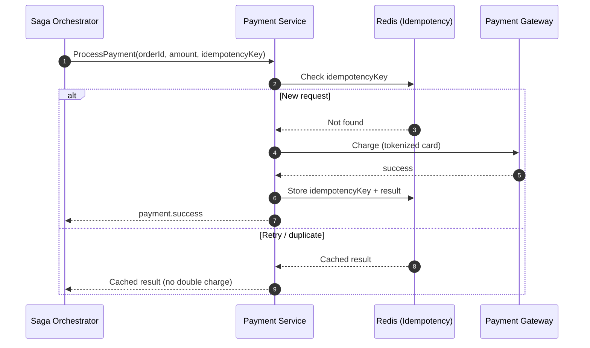

# 💳 Payment Service

The **Payment Service** handles financial transactions and integrates with third-party payment providers.

## 🗺️ Payment Flow

## 🛠️ Tech Stack

- **Framework**: NestJS
- **Data Store**: Redis (for idempotency keys)
- **Messaging**: NATS JetStream

## 📋 Responsibilities

1. **Transaction Processing**: Securely handling payment gateways (Stripe, PayPal, etc.).
2. **Idempotency Guarantee**: Ensuring a user is never charged twice for the same order.
3. **Refund Logic**: Reversing transactions when orders are cancelled.

## 🛡️ Security

- **PCI Compliance Patterns**: Never storing raw card data; using secure tokens.
- **Idempotency Keys**: Tracking every request to prevent duplicate charges during network retries.

---

[⬅️ Back to Services Index](./README.md)
