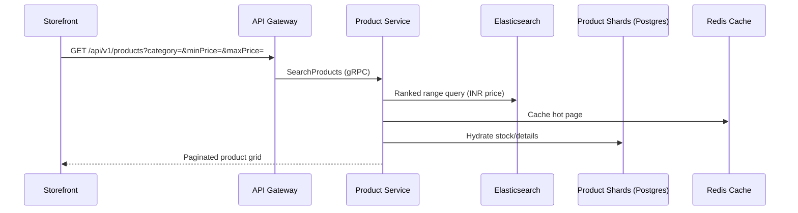

# 📦 Product Service

The **Product Service** manages the core commerce catalog — products, categories, search, reviews, and recommendations — built for a **1M+ SKU** catalog.

## 🛠️ Tech Stack

- **Framework**: NestJS
- **Data Store**: PostgreSQL (sharded ×4 + replicas, via pgBouncer)
- **Search**: Elasticsearch (3-node cluster) for ranking, faceted filters, and recommendations
- **Cache**: Redis for hot result sets and ranked lists
- **Currency**: Catalog prices are stored and filtered in **INR**

## 📋 Responsibilities

1. **Catalog Management**: CRUD operations for products and their metadata.
2. **Search & Discovery**: Ranked full-text queries, category/price-range filters, suggestions, trending & popular.
3. **Reviews**: Create reviews and aggregate rating summaries across shards.
4. **Recommendations**: Similar products, frequently-bought, recently-viewed (driven by behavior events).
5. **Database Sharding**: Horizontal partitioning keyed by category/SKU across 4 physical shards.
6. **Price Range Filtering**: `minPrice`/`maxPrice` are applied against INR prices in Elasticsearch, so filters always match what shoppers see.

## 🗺️ Search & Filter Flow

---

[⬅️ Back to Services Index](./README.md)
