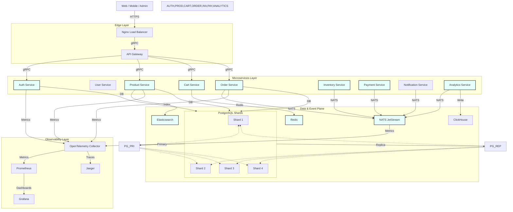

# Scaling Architecture Diagram (Mermaid)

**Key Takeaways from the Diagram**

- **Edge → Load Balancer → API Gateway**: Single entry point that distributes traffic across all service replicas.
- **Microservices**: Each service (Auth, Product, Order, etc.) is **stateless** and can be independently scaled via Kubernetes HPA or Docker‑Compose replica scaling.
- **Data & Event Plane**:
  - **PostgreSQL** is sharded (4 shards for Orders, 4 for Products) with **PgBouncer** pools for read/write separation.
  - **Redis** provides ultra‑fast cache for carts, sessions, and locks.
  - **NATS JetStream** acts as the durable event bus for the Saga pattern.
  - **Elasticsearch** handles search and recommendation workloads.
  - **ClickHouse** stores analytics events.
- **Observability**: OpenTelemetry collects metrics/traces, feeding Prometheus (metrics) and Grafana (dashboards) and Jaeger (traces) for proactive scaling decisions.

This diagram captures the core components and data flow that enable the platform to target **10 M+ users**, **1 M+ products**, and **tens of thousands of concurrent sessions** while maintaining sub‑second latency.
